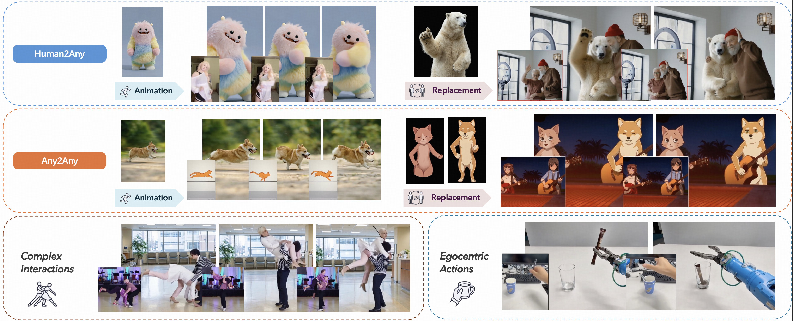
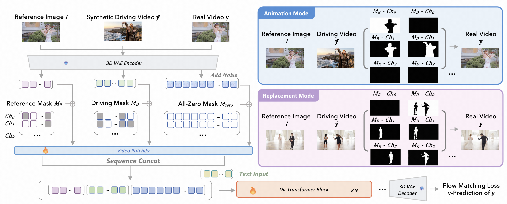
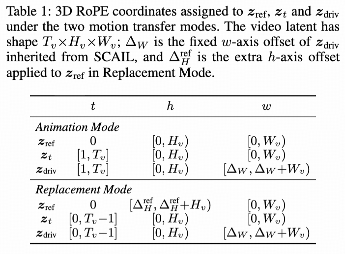

 <h1>SCAIL-2: Unifying Character Image Animation with End-to-end In-Context Conditioning</h1>


 <div align="center">
  
  
  
  
</div>


This repository contains the official implementation code of SCAIL-2: Unifying Character Image Animation with End-to-end In-Context Conditioning. The code is for the inference of SCAIL-2 Model, the first opensourced model to support **End-to-End** Character Animation.


<p align="center">
  
</p>

## 🔎 Motivation and Results
SCAIL-1 identifies the key bottlenecks that hinder character animation towards production level: how to represent the pose and how to inject the pose. However, the reliance on intermediate pose representation still hinders the model towards complex motion and generalizable identity. In this work, we try to expand the application of character animation from **Human2Any** to **Any2Any** with **End-to-End Conditioning**.

<p align="center">
  
</p>


To bypass intermediate pose representation, we utilize several off-the-shelf open-source model to synthesize 40K motion pairs, of which over 60% are generated by SCAIL-1. We design a Unified Motion Transfer Interface, containing 2 type of masking channels and a dedicated RoPE design to support training on the heterogeneous data.
From the data composition, the final model yield emergent capabilities. For example, it is the first open-source model to support cross-identity replacement, and it can now support more advanced control intermediate like [SAM3D-Body](https://github.com/facebookresearch/sam-3d-body) in zero-shot manner with noticable performance improvements.

<p align="center">
  
</p>


## 🚀 Getting Started
### Checkpoints Download

| ckpts       | Download Link                                                                                                                                           |    Notes                      |
|--------------|---------------------------------------------------------------------------------------------------------------------------------------------------------|-------------------------------|
| SCAIL-2 | Coming Soon     | Trained with mixed resolutions and fps. <br> End-to-end driven supports both 512p and 704p. <br> Pose-driven performs better under 704p.  <br> H and W should be both divisible by 32<br> (e.g. 704*1280) if using other resolutions. |

Use the following commands to download the model weights
(We have integrated both Wan VAE and T5 modules into this checkpoint for convenience).

```bash
# Download the repository (skip automatic LFS file downloads)
GIT_LFS_SKIP_SMUDGE=1 git clone https://huggingface.co/zai-org/SCAIL-2
```
The files should be organized like:
```
SCAIL-2/
├── Wan2.1_VAE.pth
├── model
│   ├── 1
│   │   └── mp_rank_00_model_states.pt
│   └── latest
└── umt5-xxl
    ├── ...
```


### Environment Setup
Please make sure your Python version is between 3.10 and 3.12, inclusive of both 3.10 and 3.12.
```
pip install -r requirements.txt
```

## 🦾 Usage
### Input preparation
The input data should be organized as follows, we have provided some example data in `examples/`:
```
examples/
├── 001
│   ├── driving.mp4
│   ├── ref.jpg
└── 002
    ├── driving.mp4
    └── ref.jpg
...
```
### Pose Extraction & Rendering
Use git submodule to download the `scail_pose` module and then follow the [POSE_INSTRUCTION.md](POSE_INSTRUCTION.md) to extract and render the pose from the driving video. 

```shell
git submodule update --init --recursive
```
After that, the project structure should be like this:
```
SCAIL-2/
├── examples
├── sat
├── configs
├── ...
├── scail_pose
```
Change dir into the subdir and follow instructions:
```shell
cd scail_pose
# follow instructions in POSE_INSTRUCTION.md
```
After pose extraction and rendering, the input data should be organized as follows:
```
examples/
├── 001
│   ├── driving.mp4
│   ├── ref.jpg
│   └── rendered_v2.mp4
└── 002
...
```

### Model Inference
For inference in SAT, run the following command to start the inference with CLI input:
```
bash scripts/sample_sgl_14Bsc_xc_cli.sh
```

The CLI will ask you to input in format like `<prompt>@@<example_dir>`, e.g. `the girl is dancing@@examples/001`. The `example_dir` should contain rendered.mp4 or rendered_aligned.mp4 after pose extraction and rendering. Results will be save to `samples/`.

We support direct txt input too, change `input_file` in [sample_sgl_14Bsc_xc_txt.yaml](configs/sampling/sample_sgl_14Bsc_xc_txt.yaml) to path of your input file, and fill in the input file with format like `<prompt>@@<example_dir>`, then run the following command:
```
bash scripts/sample_sgl_14Bsc_xc_txt.sh
```

Note that our model is trained with **long detailed prompts**, even though a short or even null prompt can be used, the result may not be as good as the long prompt. We will provide our prompt generation snippets, using Google [Gemini](https://deepmind.google/models/gemini/) to read from the reference image and the driving motion and generate a detailed prompt like `A woman with curly hair is joyfully dancing along a rocky shoreline, wearing a sleek blue two-piece outfit. She performs various dance moves, including twirling, raising her hands, and embracing the lively seaside atmosphere, her tattoos and confident demeanor adding to her dynamic presence.` 

You can further choose sampling configurations like resolution in the yaml file under `configs/sampling/` or directly modify `sample_video.py` for customized sampling logic.

## ✨ Acknowledgements
Our implementation is built upon the foundation of [Wan 2.1](https://github.com/Wan-Video/Wan2.1) and the overall project architecture is inherited from [SCAIL](https://github.com/zai-org/SCAIL). Thanks for their remarkable contribution and released code.

## 📄 Citation

If you find this work useful in your research, please cite:

```bibtex
@article{yan2025scail,
  title={SCAIL: Towards Studio-Grade Character Animation via In-Context Learning of 3D-Consistent Pose Representations},
  author={Yan, Wenhao and Ye, Sheng and Yang, Zhuoyi and Teng, Jiayan and Dong, ZhenHui and Wen, Kairui and Gu, Xiaotao and Liu, Yong-Jin and Tang, Jie},
  journal={arXiv preprint arXiv:2512.05905},
  year={2025}
}
```

## 🗝️ License
This project is licensed under the Apache License 2.0 - see the [LICENSE](LICENSE) file for details.
